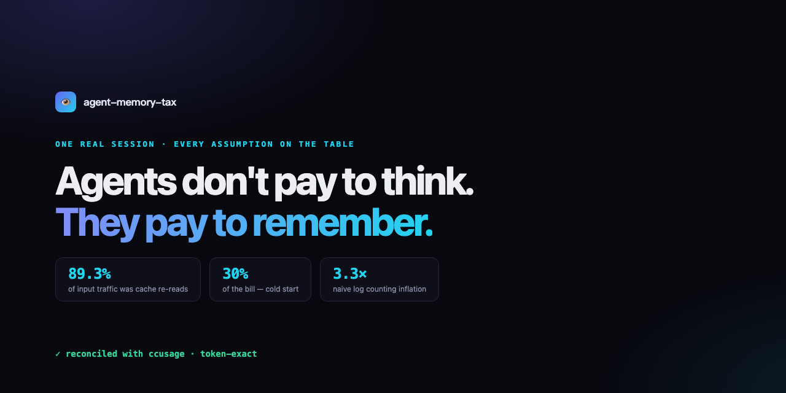
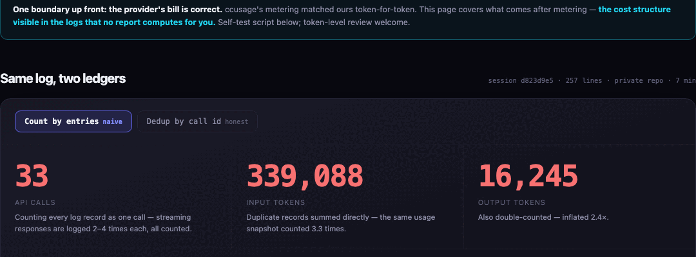

<p align="right"><a href="article.zh.md">中文</a> · <a href="https://qianjinguo.github.io/agent-memory-tax/zh.html">交互页（中文）</a></p>

<p align="center"></p>

<p align="center">
  <a href="LICENSE"></a>
  
  
</p>

## We counted our own agent bill wrong by 3×

Forensics on one real Claude Code session — 7 minutes, one code-review task, 257 lines of local logs:

- **Naive log counting inflates input 3.3× and API calls 3×** — 33 log entries are really 11 calls
- **89.3% of input traffic is cache re-reads** — riding the ~1/10-price invisible lane
- **Cold start ≈ 30% of the bill** — the first call paid full price for 66,609 tokens
- **One Bash result ≈ 16%** — a single 27,189-token output, the classic hidden fat order

First, the elephant in the room: **the provider's bill is correct.** We reconciled against [ccusage](https://github.com/ryoppippi/ccusage) and it matches our deduplicated numbers to the token. What was wrong is hand-counting from logs. And that exposes the actual question:

> **Metering is solved. Diagnosis is not.** 89.3% of input traffic was cache re-reads. 30% of the bill was cold start. One command ate 16%. No tool surfaces any of this.

## Same log, two ledgers

| Counting method | API calls | Input tokens | Output tokens |
|---|---|---|---|
| By log entries (naive) | 33 | 339,088 | 16,245 |
| Dedup by `message.id` (real) | **11** | **103,616** | **6,734** |



## Where the money actually goes

Typical pricing ratios (fresh = 1, cache read = 0.1, output = 5):

| Component | Share |
|---|---|
| Fresh input — of which **cold start alone ≈ 30%** of the whole bill | ≈ 46% |
| Cache re-reads — the real shape of the context tax | ≈ 39% |
| Output — the last long reply alone was 31% of all output | ≈ 15% |

One sentence: **85% of the bill is memory operations** — loading context and re-reading history. Thinking is 15%. Under typical ratios, memory costs ~5.7× more than thinking.

## The 30-second self-test

Run it on your own `~/.claude/projects`, then go ask your current cost tool why its numbers differ:

```python
import json, glob, os
calls = {}
for fp in glob.glob(os.path.expanduser('~/.claude/projects/*/*.jsonl')):
    for line in open(fp, encoding='utf-8'):
        try:
            r = json.loads(line)
        except ValueError:
            continue
        if r.get('type') != 'assistant':
            continue
        m = r.get('message') or {}
        u = m.get('usage')
        if not (m.get('id') and u):
            continue
        calls[m['id']] = u  # dedup by message.id
fresh = sum(u.get('input_tokens', 0) for u in calls.values())
cache = sum(u.get('cache_read_input_tokens', 0) for u in calls.values())
out   = sum(u.get('output_tokens', 0) for u in calls.values())
print(f"API calls: {len(calls)} | fresh: {fresh:,} | cache: {cache:,} ({cache/(fresh+cache):.0%}) | out: {out:,}")
```

## Interactive page

**[Live interactive version](https://qianjinguo.github.io/agent-memory-tax/)** (English; [中文版](https://qianjinguo.github.io/agent-memory-tax/zh.html)) — one click toggles between the naive and honest ledger, plus the full "what we claim / what we don't" list. `?mode=honest` deep-links the honest ledger.

| Naive ledger | Honest ledger |
|---|---|
|  |  |

## Full write-up

[article.zh.md](article.zh.md) (Chinese) — methodology and error bounds, the reconciliation experiment, and the multi-tool support matrix:

<details>
<summary><b>Multi-tool support matrix (verified first-hand on this machine)</b></summary>

| Tool | Status |
|---|---|
| Claude Code | ✅ verified — usage four-piece + `message.id`, this post's calibration target |
| ZCode | ✅ verified — full request bodies + exact usage, CJK estimate error 0.97–1.02 |
| Codex CLI | ✅ verified — fresh / cache-read / cache-write split, reasoning tokens listed, plus 5h & weekly quota percent |
| OpenCode / pi agent / Hermes | ⚠ verified gaps — export required or no usage fields (volume estimation only) |
| Pure-cloud tools (e.g. DeepSeek web) | ✕ no local logs — hard boundary of the zero-integration method |

</details>

## Limitations (the honest section)

n=1. Pricing ratios are assumptions — logs contain tokens, not dollars. The GLM endpoint was proxied and `cache_creation` was always 0 (likely dropped by the proxy). The methodology is pinned to Claude Code v2.1.153; runtimes drift, so re-validate on upgrade.

## License

MIT
